# 视频生成流程线框图

> 对应《视频生成系统 · 技术架构与开发计划》v1.3，描述"一句话 → 成片"的端到端流程。
> 上图（Mermaid）可在支持的阅读器中直接渲染；下图（ASCII）为纯文本等价版本。

## 一、端到端主流程（Mermaid）

```mermaid
flowchart TD
    U[用户输入<br/>提示词 / URL / 图片 / 文档] --> VP[Stage 0 · video_pipeline<br/>端到端编排 · 断点续跑]

    VP --> S1[Stage 1 · video_spec<br/>描述文件生成]
    subgraph S1D[ ]
        S1A[ask_user 澄清<br/>受众 / 长度预设 7·10·13 屏 / 风格] --> S1B[web_fetch · MinerU<br/>多源素材解析]
        S1B --> S1C[LLM 生成<br/>style 设计块 + 逐屏 PageModel]
        S1A --> S1C
        S1C --> S1D1{JSON Schema §10<br/>机器校验}
        S1D1 -->|通过| S1D2{§13 语义清单复查}
        S1D1 -->|失败| S1C
        S1D2 -->|失败| S1C
    end
    S1 --> S1D
    S1D -->|通过| Y[(data/videos/xx_epNN.yaml<br/>★ 唯一事实源)]

    Y --> S2[Stage 2 · asset_gen<br/>素材生成]
    S2 --> S2A[imagegen 插画 + .meta.json<br/>web 截图 · 图表数据 · BGM]
    S2A --> A[(assets/ · data/)]

    Y --> S3[Stage 3 · narration_gen<br/>配音与字幕]
    S3 --> S3A[narration 三段式 → TTS<br/>逐屏 s01.wav...]
    S3A --> S3B[whisperX 词级时间戳<br/>真实时长 → .align.json]
    S3B --> AU[(audio/<br/>wav + .align.json)]

    Y --> S4[Stage 4 · video_compose<br/>合成调度]
    A --> S4
    AU --> S4
    S4 --> RW[remotion-worker · Node]

    subgraph RWD[remotion-worker 内部]
        R1[YAML → ajv 校验 → IR<br/>默认值注入 · 时长覆盖 · 样式链合并] --> R2[type/layout → Scene/布局组件<br/>KaTeX · Math.js · three.js 特效]
        R2 --> R3[字幕轨 + BGM 混音]
        R3 --> R4[headless Chrome 逐帧 → ffmpeg]
    end
    RW --> RWD
    RWD --> MP4[(renders/job_id.mp4)]
    RW -.WS 进度事件.-> UI[Web UI / CLI]

    style Y fill:#fff3cd,stroke:#d4a017,stroke-width:2px
    style MP4 fill:#d4edda,stroke:#28a745,stroke-width:2px
```



## 二、纯文本线框版

```
 用户输入（提示词 / URL / 图片 / 文档）
        │
        ▼
 ┌──────────────────────────────────────────────────────────┐
 │ Stage 0 · video_pipeline（编排入口，逐阶段调度，断点续跑） │
 └──────────────────────────────────────────────────────────┘
        │
        ▼
 ┌─ Stage 1 · video_spec ─────────────────────────────────┐
 │ ask_user 澄清（受众/长度/风格）                           │
 │ web_fetch · MinerU 解析多源输入                          │
 │ LLM：style 设计块 → 逐屏 PageModel（骨架复制+槽位填充）   │
 │  ┌─ 校验回环 ─────────────────────────────────────────┐ │
 │  │ JSON Schema §10 机器校验 → §13 语义清单复查        │ │
 │  │        ↑__________ 不通过则带错误回炉 __________│ │
 │  └────────────────────────────────────────────────────┘ │
 └──────────────────────────────────────────────────────────┘
        │ 产出
        ▼
 ★ data/videos/<series>_ep<NN>.yaml —— 唯一事实源（进 git）
        │
        ├──────────────────────┬───────────────────────────┐
        ▼                      ▼                           ▼
 ┌─ Stage 2 · asset_gen ──┐ ┌─ Stage 3 · narration_gen ─┐ │
 │ imagegen 插画+.meta.json│ │ narration 三段式 → TTS     │ │
 │ 沙箱截图 · 图表数据·BGM │ │ whisperX 词级时间戳        │ │
 └──────────┬─────────────┘ │ 真实时长 → .align.json     │ │
            ▼               └──────────┬────────────────┘ │
     assets/ · data/                   ▼                  │
                            audio/*.wav + .align.json     │
            │                          │ (时长不回写 YAML) │
            └──────────────┬───────────┘                  │
                           ▼                              │
 ┌─ Stage 4 · video_compose → remotion-worker (Node) ──────┘
 │ YAML → ajv 校验 → IR（默认值/时长覆盖/样式链合并）        │
 │ type·layout → Scene/布局组件（KaTeX · three.js 特效）    │
 │ 字幕轨 + BGM 混音 → headless Chrome 逐帧 → ffmpeg       │
 └──────────────────────────┬───────────────────────────────┘
                            ▼
                renders/<job_id>.mp4  ──WS 进度──▶ Web UI / CLI
```

## 三、迭代回路（改片不重走全流程）

```
 改字/改色 ──▶ 编辑 YAML ──▶ Remotion Player 即时预览（不渲染）
                          └─▶ --frames 局部重渲染该屏区间 ──▶ 拼接出片

 只改配音 ──▶ 重跑 narration_gen（.align.json 更新）──▶ 重渲染
 只改素材 ──▶ 重跑 asset_gen（对应屏）────────────▶ 重渲染
 推倒重来 ──▶ video_pipeline 从头（旧产物目录保留可追溯）
```

## 四、关键契约点

| 交接点 | 载体 | 说明 |
|---|---|---|
| Stage 1 → 全局 | `data/videos/*.yaml` | 唯一事实源，创作层，人可直接编辑 |
| Stage 2 → Stage 4 | `assets/` + `.meta.json` | 素材 + 生成参数（prompt/模型/种子），可复现 |
| Stage 3 → Stage 4 | `audio/*.wav` + `.align.json` | 真实时长在 IR 注入期覆盖 `duration_frames`，不回写 YAML |
| backend → worker | `POST /render {yaml_path, job_id}` | 渲染任务契约，SQLite 记录状态 |
| worker → 用户 | WS 进度事件 + `renders/<job_id>.mp4` | Activity 面板可见 |
